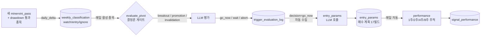
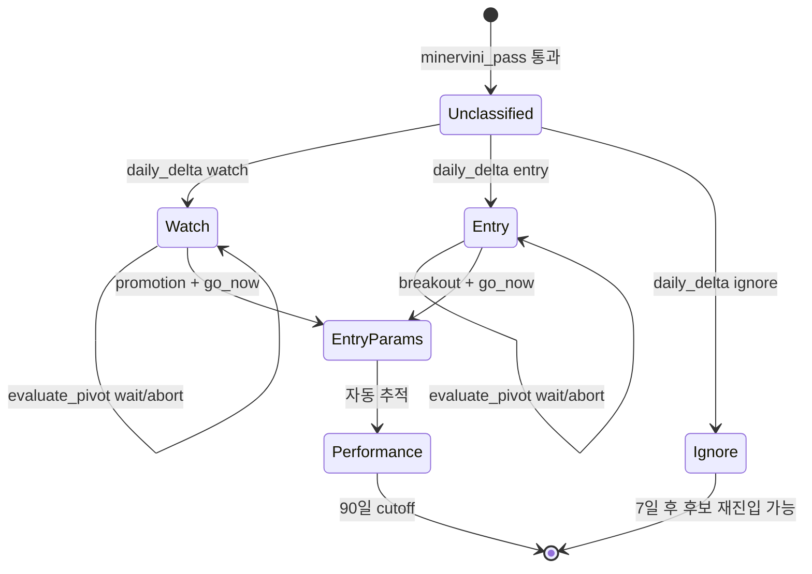

# LLM 분석 안내 페이지 Design

**Goal:** `/docs/llm-pipeline` 라우트에서 LLM 분석 4 단계 (daily_delta / evaluate_pivot / entry_params / performance) 의 흐름·로직·조건·책 원전을 정적 정리하여, 사용자가 시스템 이해 + 향후 수정 기반으로 사용할 수 있는 문서 페이지를 제공한다.

**Scope:** 페이지 1개 + Mermaid 다이어그램 2개 + 정적 콘텐츠 (TypeScript 상수). API / DB / Pydantic / backend 변경 **없음**.

**Single source of truth:** 페이지 안의 TypeScript 상수 (`STAGES` 등). PIPELINE_SPECS 의 일부 정보 (inputs/outputs/depends_on) 와 의도적으로 중복 — 페이지의 목적이 stage 별 분해 + 책 원전 + 추론 흐름이라 단순 spec 보다 풍부.

---

## 1. 라우팅 + 사이드바

### 1-1. 라우트

`web/src/App.tsx`:
```tsx
<Route path="/docs/llm-pipeline" element={<LlmPipelinePage />} />
```

### 1-2. 사이드바

`NAV_ITEMS` 에 새 항목 추가 — "LLM 분류" 와 "분석 운영" 사이:

```tsx
{ to: "/docs/llm-pipeline", label: "LLM Pipeline Guide", kr: "LLM 분석 안내", Icon: BookOpen }
```

Icon: lucide-react 의 `BookOpen` (책 모양 — docs 의미).

---

## 2. 페이지 구조 (7 섹션)

```
┌──────────────────────────────────────────────────────┐
│ ① 헤더                                              │
│   - caps: Documentation                              │
│   - title: LLM 분석 안내                            │
│   - subtitle: 평일 LLM 분석 4 단계 흐름 + 책 원전     │
├──────────────────────────────────────────────────────┤
│ ② 개요                                              │
│   - 한 단락 설명 (LLM full-daily 가 4 단계)         │
│   - Mermaid 다이어그램 #1: 4 단계 데이터 흐름        │
├──────────────────────────────────────────────────────┤
│ ③ 단계별 카드 (4개)                                 │
│   각 카드 구조:                                      │
│   - id 배지 (예: "1 / daily_delta")                  │
│   - label + summary                                  │
│   - 대상 종목 (조건)                                 │
│   - 입력/출력 (테이블 chip 리스트)                   │
│   - 결정론 로직                                      │
│   - LLM 로직 + 결정 enum (있으면)                   │
│   - 결과 액션                                        │
│   - 책 원전 chip                                     │
│   - 코드 참조 (kr_pipeline/llm_runner/*.py:line)    │
├──────────────────────────────────────────────────────┤
│ ④ 종목 상태 전이도                                  │
│   - Mermaid 다이어그램 #2: 종목이 어떤 상태로 흐르는지 │
├──────────────────────────────────────────────────────┤
│ ⑤ 트리거 vs LLM 결정 매트릭스                       │
│   3×3 표:                                           │
│   행: breakout / promotion / invalidation           │
│   열: go_now / wait / abort                         │
│   각 셀: 의미 + 다음 단계 연결                       │
├──────────────────────────────────────────────────────┤
│ ⑥ 용어집                                            │
│   - classification (watch/entry/ignore) vs signal   │
│   - trigger_type vs decision (두 단계 구분)         │
│   - 분류 변경은 어디서?                              │
│   - dry-run 의 의미                                  │
│   - performance 90일 cutoff 의 의미                  │
├──────────────────────────────────────────────────────┤
│ ⑦ FAQ                                              │
│   - Watch 가 자동 entry 로 승격 안 되는 이유?       │
│   - Pivot 없는 watch 종목은 어떻게 되나?            │
│   - daily_delta 와 weekend batch 의 차이?           │
│   - dry-run 시 DB 영향은?                            │
└──────────────────────────────────────────────────────┘
```

---

## 3. Mermaid 다이어그램

### 3-1. 데이터 흐름도



### 3-2. 종목 상태 전이도



---

## 4. 콘텐츠 데이터 구조 (TypeScript)

페이지 안에 hardcode. 향후 백엔드 API 로 옮길 여지 있음 (out of scope).

```typescript
interface PipelineStage {
  id: "daily_delta" | "evaluate_pivot" | "entry_params" | "performance";
  label: string;
  summary: string;
  targets: string;
  inputs: string[];
  outputs: string[];
  deterministic: string;
  llm: string | null;
  decisions?: string[];
  actions: string;
  sources: string[];
  codeRef: string;
}

const STAGES: PipelineStage[] = [
  {
    id: "daily_delta",
    label: "신규 후보 분류",
    summary: "오늘 새로 minervini_pass 통과한 종목을 LLM 으로 1차 분류",
    targets:
      "daily_indicators 의 오늘 행 중 minervini_pass=TRUE AND drawdown_filter_pass=TRUE + 최근 7일 내 분류 이력 없음 (= 신규 후보).",
    inputs: ["daily_indicators", "daily_prices", "weekly_indicators", "market_context_daily"],
    outputs: ["weekly_classification"],
    deterministic: "결정론 필터 — minervini_pass + drawdown_filter + 신규성 (7일).",
    llm:
      "analyze_chart_v3.md prompt + zip 13개 파일 (payload.json + market_context + corporate_actions + minervini + daily/weekly chart 이미지 등). 9개 base 패턴 + 13 risk flag taxonomy 적용.",
    decisions: ["watch", "entry", "ignore"],
    actions:
      "weekly_classification 에 INSERT (source='daily_delta'). watch/entry 는 evaluate_pivot 의 다음 평가 대상, ignore 는 7일 후 재진입 가능.",
    sources: ["Minervini Trend Template", "O'Neil HMM 'How to Read Charts Like a Pro'"],
    codeRef: "kr_pipeline/llm_runner/daily_delta.py",
  },
  {
    id: "evaluate_pivot",
    label: "Watch/Entry 트리거 평가",
    summary: "활성 watch/entry 종목의 오늘 행동 (돌파/손절/추세) 매일 확인",
    targets:
      "weekly_classification 의 종목별 최신 분류가 watch 또는 entry + daily_indicators 의 오늘 행 있음 (close, volume, sma_50, avg_volume_20d 모두 NOT NULL + pivot_price NOT NULL).",
    inputs: ["weekly_classification", "daily_indicators"],
    outputs: ["trigger_evaluation_log"],
    deterministic:
      "결정론 트리거 게이트 (compute/trigger_gate.py): close < stop_loss 또는 close < sma_50 → invalidation. entry 종목: close > pivot AND volume >= 1.5× avg → breakout. watch 종목: close >= pivot × 0.95 AND volume >= avg → promotion.",
    llm:
      "evaluate_pivot_trigger_v1.md prompt — 게이트 통과 종목만 호출. '이 트리거가 진짜인가, 가짜 신호인가, 보류인가' 판단.",
    decisions: ["go_now", "wait", "abort"],
    actions:
      "trigger_evaluation_log 에 INSERT. 분류 자체는 변경 안 함 (prompt 명시). decision='go_now' 인 종목은 entry_params 가 자동 수집.",
    sources: [
      "O'Neil HMM ch.2 Volume Percent Change (1.5× breakout)",
      "Minervini buy/sell rules",
    ],
    codeRef: "kr_pipeline/llm_runner/evaluate_pivot.py + compute/trigger_gate.py",
  },
  {
    id: "entry_params",
    label: "매수 계획 (entry_params)",
    summary: "오늘 trigger_evaluation_log 에 go_now 결정된 종목의 매수 계획 17 필드 작성",
    targets: "trigger_evaluation_log 의 오늘 행 중 decision='go_now'.",
    inputs: ["trigger_evaluation_log", "daily_indicators", "weekly_classification"],
    outputs: ["entry_params"],
    deterministic: "decision='go_now' 행 필터.",
    llm:
      "calculate_entry_params_v2_0.md prompt — entry_mode, trigger_price, entry_price, stop_loss + 기준, expected_target_price + %, RR, position_size_pct + 기준, breakout_volume_requirement, observed_breakout_volume_ratio, known_warnings, other_warnings, notes 17개 필드 계산.",
    actions:
      "entry_params 에 INSERT (PK: symbol + signal_at). performance 가 다음 단계에서 자동 추적.",
    sources: ["Minervini risk management (1-3% per trade)", "O'Neil HMM 'Buy at the Buy Point'"],
    codeRef: "kr_pipeline/llm_runner/entry_params.py",
  },
  {
    id: "performance",
    label: "시그널 성과 추적",
    summary: "최근 90일 내 entry_params signal 의 1/2/4/8주 후 가격 및 시장 대비 수익률 추적",
    targets:
      "entry_params 의 signal_at 가 최근 90일 내. 8주 후까지만 추적 (price_8w 채워지면 종료).",
    inputs: ["entry_params", "daily_prices", "index_daily"],
    outputs: ["signal_performance"],
    deterministic:
      "signal_at 기준 +7/+14/+28/+56 일 후 daily_prices 의 close 조회. 시장 (KOSPI/KOSDAQ index_daily) 수익률도 함께.",
    llm: null,
    actions:
      "signal_performance 의 (symbol, signal_at) 행 UPSERT. 같은 종목의 여러 entry signal 은 signal_at 별 독립 추적.",
    sources: [],
    codeRef: "kr_pipeline/llm_runner/performance.py",
  },
];
```

---

## 5. 트리거 × 결정 매트릭스

표로 표시:

| Trigger \ Decision | go_now | wait | abort |
|---|---|---|---|
| **breakout** (entry 종목 돌파) | entry_params 자동 생성 → 매수 시그널 활성 | 다음 날 재평가, entry_params 없음 | 가짜 돌파로 판정, 무시. 분류는 entry 유지 |
| **promotion** (watch 종목 pivot 95%) | entry_params 자동 생성 → watch 분류 그대로지만 매수 시그널 활성 | 다음 날 재평가 | 가짜 신호, watch 유지 |
| **invalidation** (stop_loss 또는 sma_50 하회) | (적용 안 됨) | (적용 안 됨) | base 무효화 인정. 다만 분류 변경은 다음 weekend/daily_delta 까지 정지 |

---

## 6. 용어집

| 용어 | 의미 |
|---|---|
| **classification** | watch / entry / ignore — LLM 의 종목 정성 평가. weekly_classification.classification 컬럼. 자주 안 바뀜. |
| **signal** | entry_params 의 새 row — 실질 매수 시그널. classification 과 별개 차원. |
| **trigger_type** | breakout / promotion / invalidation — 결정론 게이트가 감지한 오늘의 이벤트. |
| **decision** | go_now / wait / abort — LLM 이 그 트리거에 대해 내린 행동 결정. |
| **분류 변경** | weekly_classification.classification 의 변경. weekend batch 또는 daily_delta 의 신규 후보 재진입 시에만. evaluate_pivot 은 분류 변경 안 함. |
| **dry-run** | LLM 호출은 mock 응답, **DB INSERT 도 skip**. read-only 검증 모드. |
| **90일 cutoff** | performance 가 추적하는 signal 의 기간 한계 — signal_at 가 90일 이전이면 추적 안 함. 8주 데이터 채워지면 사실상 종료. |

---

## 7. FAQ

각각 한 단락 답변:

- **Watch 가 evaluate_pivot 의 LLM 결정으로 자동 entry 승격되지 않는 이유?** → prompt §1 의 "분류 재평가 금지" 정책. classification 은 weekend/daily_delta 만 변경. evaluate_pivot 은 promotion 트리거 + go_now → entry_params 만 생성 (분류는 watch 유지). 실질 매수 시그널은 entry_params 의 새 row 로 표현.
- **Pivot 없는 watch 종목은 어떻게 되나?** → evaluate_pivot 의 결정론 게이트가 pivot_price IS NULL 인 종목을 skip (`compute/trigger_gate.py`). 매일 평가 사이클에서 빠짐. 다음 weekend/daily_delta 재분류 까지 정지 상태.
- **daily_delta 와 weekend batch 의 차이?** → 둘 다 같은 prompt (analyze_chart_v3.md) + 같은 zip. 차이는 대상 풀: daily_delta = 신규 (7일 내 분류 없는 minervini 통과), weekend = 전체 minervini 통과 (재분류 가능). daily_delta 는 평일 매일, weekend 는 토요일 03:20.
- **dry-run 시 DB 영향은?** → 0. mock LLM 응답 받고 응답 파싱까지는 진행 (검증), 그러나 store 호출 직전 가드 (`if dry_run: return`) 로 INSERT skip. weekly_classification / trigger_evaluation_log / entry_params 모두 영향 없음.

---

## 8. 컴포넌트 분리

| 파일 | 책임 |
|---|---|
| `web/src/pages/LlmPipelinePage.tsx` | 메인 페이지 + STAGES 상수 + FAQ/용어집 hardcode + 7 섹션 렌더 |
| `web/src/components/MermaidDiagram.tsx` | Mermaid wrapper (lazy import — 페이지 첫 진입 부담 최소화) |
| `web/src/App.tsx` | NAV_ITEMS + Routes 변경 |

---

## 9. 의존성

- `mermaid` 패키지 (npm i mermaid) — 약 1MB minified, **dynamic import** 로 lazy load (다른 페이지에 영향 안 줌)
- 이미 있는 라이브러리 (react-markdown 등) 재활용 — 본 페이지에선 markdown 안 씀 (정적 JSX)

---

## 10. Testing

### Frontend

- tsc 0 errors
- 수동:
  - `/docs/llm-pipeline` 진입 → 7 섹션 모두 표시
  - Mermaid 다이어그램 2개 정상 렌더 (페이지 첫 로드 시 lazy load 동작)
  - 사이드바 "LLM 분석 안내" 메뉴 클릭 → 라우팅
  - 각 stage 카드의 코드 참조가 실제 파일 경로와 일치

### Backend

- 영향 없음 (페이지 진입은 API 호출 0)

---

## 11. Out of scope

- **LLM evaluation suite** (자동 검증 / golden set 비교)
- **콘텐츠 동적화** (CMS, markdown 파일, API) — 정적 hardcode 부터 시작
- **다국어** (영어 버전)
- **ohlcv / indicators / market_context 데이터 적재 단계 설명** — 별도 페이지 (`/docs/data-pipeline`) 차후 작업
- **편집 가능 UI** (페이지 내에서 직접 콘텐츠 수정) — 코드 수정으로
- **PIPELINE_SPECS 와의 통합** (long_description 분해) — STAGES 가 더 세분된 메타라 의도적 중복 유지

---

## Architecture summary

```
PIPELINE_SPECS (기존)  ← LLM full-daily 의 4 stage 가 sub-step 으로 묶여있음
                            ↑
LlmPipelinePage (신규)
  └─ STAGES (4개 카드의 typed 상수)
     ├─ daily_delta
     ├─ evaluate_pivot
     ├─ entry_params
     └─ performance

  ├─ MermaidDiagram (lazy import)
  │   ├─ 데이터 흐름도
  │   └─ 종목 상태 전이도
  │
  ├─ 트리거 × 결정 매트릭스 (3×3 표)
  ├─ 용어집 (dict)
  └─ FAQ (Q&A 리스트)

App.tsx
  ├─ NAV_ITEMS + "LLM 분석 안내"
  └─ <Route path="/docs/llm-pipeline" element={<LlmPipelinePage />} />
```
