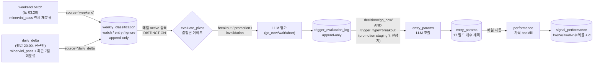

# LLM 분석 검증 페이지 (`/docs/llm-pipeline/audit`) — 설계 v2

## 목적

Minervini / O'Neil 책 전문가가 한 페이지만 보고 우리 LLM 분석 시스템 전체 (스케줄링 / 필터링 / 결정론 로직 / LLM prompt 결정 규칙 / 책 인용 정확성) 를 line-by-line 검증할 수 있는 단일 페이지를 추가한다.

기존 `/docs/llm-pipeline` (이하 "안내 페이지") 은 시뮬레이션 + 개요 중심으로 유지하고, 본 페이지는 **모든 임계값, 모든 분기 조건, 모든 prompt 내용, 책 원문 인용** 을 전부 담는 깊이 우선 페이지.

> **v2 갱신 (2026-05-22)**: spec v1 작성 후 코드와의 line-by-line 비교를 7 part 로 수행하여 발견된 누락 / 부정확 / 잠재적 버그를 모두 반영.

## 비범위

- 새 분석 로직 / 새 prompt 추가. 본 페이지는 **현재 시스템의 정확한 서술** 만 다룸.
- 한국어 외 다른 언어 단일 페이지. 본문 한국어 + 책 인용은 영어 원문 + 한국어 요약.
- 코드 수정. 코드 변경이 필요한 비일관성 (예: c6 임계 1.25 vs 책 1.30) 은 별도 follow-up 로 분리하고 본 페이지는 알려진 검토 사항으로 명시.

## 기존 안내 페이지와의 관계

| | 기존 `/docs/llm-pipeline` | 신규 `/docs/llm-pipeline/audit` |
|---|---|---|
| 대상 | 한국 운영자 (시스템 학습) | Minervini/O'Neil 전문가 (검증) |
| 깊이 | 시뮬레이션 + 개요 | line-by-line 깊이 |
| 길이 | 단일 페이지, 적당 | 단일 페이지, 매우 김 (수천 줄) |
| 책 인용 | 짧은 한국어 reference | 영어 원문 + 한국어 + 코드 ref |
| Prompt | 요약만 | 전체 내용 (접기) |
| 변경 시 | 우선순위 낮음 | 시스템 변경 시 즉시 반영 |

## 페이지 구조

```
┌────────────────────────────────────────────────────────────────┐
│  좌 sticky 목차 (lg:w-64)  │   메인 본문 (lg:flex-1)             │
│                            │                                    │
│  1. 시스템 개요             │   ## 1. 시스템 개요                │
│  2. 실행 스케줄             │                                    │
│  3. 단계별 상세             │   ## 2. 실행 스케줄                │
│   3.1 weekend              │                                    │
│   3.2 daily_delta          │   ## 3. 단계별 상세                │
│   3.3 evaluate_pivot       │                                    │
│   3.4 entry_params         │   ...                              │
│   3.5 performance          │                                    │
│  4. Minervini 8조건         │                                    │
│  5. Base 패턴 9개            │                                    │
│  6. Risk Flags 13개          │                                    │
│  7. LLM Payload (ZIP 13)    │                                    │
│  8. Prompt 전체 (3개)        │                                    │
│  9. 비일관성 / 변경 이력      │                                    │
└────────────────────────────────────────────────────────────────┘
```

## 본문 섹션 상세

### 1. 시스템 개요

- 한 줄 요약: "주말 1단계 (전체 재분류) + 평일 4단계 (신규 분류 → 트리거 평가 → 매수 계획 → 성과 추적)"
- **신규 mermaid 다이어그램 작성** (기존 페이지 DIAGRAM_DATA_FLOW 재사용 ❌ — 그 다이어그램은 weekend 누락 + promotion staging 안전장치 미반영. audit 페이지는 정확한 새 다이어그램 필요):



- **핵심 설계 철학** 박스:
  > 결정론 게이트는 싸고 느슨한 사전 필터 — 명백한 비후보만 제거.
  > 정밀 임계 (1.4~1.5× 표준, pocket pivot 예외, 일중 강도 등) 와 예외 판단은
  > LLM 이 차트와 함께 수행. 게이트를 책 표준에 맞추면 (1) LLM 이 무력화되고
  > (2) 책이 인정한 예외 (pocket pivot, 시장 맥락) 가 사전 배제되는 false
  > negative 발생.

- **기존 안내 페이지 mermaid 정정 follow-up** 명시: 기존 `/docs/llm-pipeline` 의 `DIAGRAM_DATA_FLOW` (weekend 누락 + 안전장치 미반영) 와 `DIAGRAM_STATE` (`Watch --> EntryParams: promotion + go_now` 잘못된 전이) 도 정정 필요. 별도 task.

### 2. 실행 스케줄

`pipeline_specs.py` 의 cron 정확한 인용. 표:

| Pipeline | Cron | KST 시각 | 실행 단계 | LLM 호출 |
|---|---|---|---|---|
| `llm-weekend` | `20 3 * * 6` | 토 03:20 | weekend (분류 batch) | Yes |
| `llm-full-daily` | `0 20 * * 1-5` | 평일 20:00 | daily_delta → evaluate_pivot → entry_params → performance | Yes (4 단계 중 3개) |
| `llm-performance` | `0 23 * * *` | 매일 23:00 | performance | No (가격 backfill) |

코드 ref: `kr_pipeline/llm_runner/pipeline_specs.py:181,205,223`.

### 3. 단계별 상세 (5 stages, 각 stage 깊은 카드)

#### 3.1 weekend stage

##### 시기
토요일 03:20 (KST). cron: `20 3 * * 6`.

##### 입력 필터

target_date 동적 결정 + minervini_pass + delisted 제외:

```python
# 1) target_date 결정 (load.py:18-24)
if as_of is None:
    cur.execute("SELECT MAX(date) FROM daily_indicators")
else:
    cur.execute("SELECT MAX(date) FROM daily_indicators WHERE date <= %s", (as_of,))
target_date = row[0]   # 보통 직전 금요일, 휴장일이 끼면 더 이전

# 2) 종목 필터 SQL (load.py:26-39)
SELECT i.ticker, s.market
  FROM daily_indicators i
  JOIN stocks s ON s.ticker = i.ticker
 WHERE i.date = %s
   AND i.minervini_pass = TRUE
   AND s.delisted_at IS NULL
 ORDER BY i.ticker
```

**참고**: `minervini_pass` 정의는 §4 참조 (8조건 모두 TRUE AND rs_rating ≥ 70).

##### 결정론 로직
없음 (필터 통과 시 LLM 호출).

##### LLM Prompt
- **파일**: `prompts/analyze_chart_v3.md` (309 행)
- **핵심 결정**: classification (entry/watch/ignore) + pattern (9 base 중 1) + pivot_price + risk_flags (13 taxonomy) + confidence + reasoning
- **결정 규칙 요약**: Stage 2 확인 → 시장 컨텍스트 (downtrend/correction 시 watch 강제) → base 패턴 식별 → risk flags 적용 → pivot 산출

##### 출력
- **테이블**: `weekly_classification` (kr_pipeline/db/schema.sql:256)
- **INSERT 컬럼**: symbol, classified_at, analyzed_for_date, market, classification, pattern, pivot_price, pivot_basis, base_high, base_low, base_depth_pct, base_start_date, risk_flags (JSONB), confidence, reasoning, source='weekend', llm_call_duration_s, llm_input_tokens, llm_output_tokens, created_at
- **INSERT 정책**: `ON CONFLICT (symbol, classified_at) DO NOTHING` — append-only
- "현재 분류" 조회: `DISTINCT ON (symbol) ... ORDER BY symbol, classified_at DESC`

##### Side Effects
- `notify_weekend_digest()` (modes.py:run_weekend) — Slack digest 알림 (entry/watch/ignore 카운트)
- **End-of-run 1회 retry** (weekend.py:66-76): 실패 종목 한 번 더 시도. daily_delta/evaluate_pivot/entry_params 와는 다른 정책.

##### 특수 모드
- **단일 종목 디버깅**: `weekend.py:38-39` — `ticker` 인자 주면 단일 종목만 처리.
- **dry-run**: ZIP 빌드 + LLM mock 호출 + 응답 파싱까지 진행, DB INSERT 만 skip.

##### 책 근거
📖 *Minervini, Trade Like a Stock Market Wizard, Ch.5 "Trend Template"*:
> "A stock must meet all eight criteria of the Trend Template..."

한국어: 8조건 모두 충족 종목만 가능 (§4 참조).

##### 코드 참조
- 오케스트레이션: `kr_pipeline/llm_runner/modes.py:run_weekend`
- 입력 필터: `kr_pipeline/llm_runner/load.py:get_qualifying_tickers`
- 종목별 처리: `kr_pipeline/llm_runner/weekend.py`

---

#### 3.2 daily_delta stage

##### 시기
평일 20:00 (KST), `llm-full-daily` 의 첫 단계. cron: `0 20 * * 1-5`.

##### 입력 필터

신규 후보 (오늘 결정론 통과 + 최근 7일 분류 없음):

```sql
-- compute/delta.py:22-36
SELECT i.ticker
  FROM daily_indicators i
 WHERE i.date = %s                          -- as_of
   AND i.minervini_pass = TRUE
   AND NOT EXISTS (
     SELECT 1 FROM weekly_classification wc
      WHERE wc.symbol = i.ticker
        AND wc.classified_at >= %s          -- as_of - RECENT_WINDOW_DAYS (7)
   )
 ORDER BY i.ticker
```

상수: `RECENT_WINDOW_DAYS = 7` (compute/delta.py:12)

##### ⚠️ 잠재적 코드 버그

이 SQL 은 `stocks.delisted_at IS NULL` 필터가 없음. weekend 의 `get_qualifying_tickers` (§3.1) 는 `JOIN stocks WHERE s.delisted_at IS NULL` 적용. 일관성 어긋남 — 상장폐지 종목이 daily_indicators 에 남아 있다면 daily_delta 가 잡을 가능성. §9.2 검토 사항 참조.

##### 결정론 로직
없음 (필터 통과 시 LLM 호출).

##### LLM Prompt
- **파일**: `prompts/analyze_chart_v3.md` (309 행, **weekend 와 동일**)
- 차이는 입력 필터 (신규 조건) 와 `source` 컬럼만.

##### 출력
- **테이블**: `weekly_classification`
- **source='daily_delta'**
- 나머지 컬럼/정책은 weekend 와 동일.

##### Side Effects
- **retry 없음** — weekend 와 다름. 실패 종목은 log only, 다음 날 cron 에서 다시 후보가 되면 재처리.

##### 책 근거
weekend 와 동일 (같은 prompt).

##### 코드 참조
- 입력 필터: `kr_pipeline/llm_runner/compute/delta.py:find_new_tickers`
- 종목별 처리: `kr_pipeline/llm_runner/daily_delta.py`

---

#### 3.3 evaluate_pivot stage

##### 시기
평일 20:00 (KST), `llm-full-daily` 의 2단계 (daily_delta 다음).

##### 입력 필터

3 단계로 구성:

**1) Active 종목 조회** (load.py:48-57):
```sql
SELECT DISTINCT ON (symbol)
       symbol, classified_at, market, classification, pattern,
       pivot_price, base_low, base_high
  FROM weekly_classification
 ORDER BY symbol, classified_at DESC
```

**2) classification 필터 (Python 리스트 컴프리헨션, SQL 아님)** (load.py:72):
```python
return [
    {...} for r in rows
    if r[3] in ("entry", "watch")
]
```

**3) 오늘 시장 데이터 조인 + 필수 컬럼 NULL 체크** (load.py:89-110 + evaluate_pivot.py:36-40):
```python
# load.py:89-102 — daily_indicators 의 오늘 행 조인
SELECT i.ticker, i.adj_close AS close, i.volume,
       i.avg_volume_50d, i.sma_50
  FROM daily_indicators i
 WHERE i.ticker = ANY(%s) AND i.date = %s

# load.py:109 — stop_loss 는 weekly_classification.base_low alias
enriched.append({**a, **cur_data, "stop_loss": a.get("base_low", 0)})

# evaluate_pivot.py:36-40 — 6 필수 컬럼 NULL 체크
if not all(
    a.get(k) is not None
    for k in ("close", "pivot_price", "volume", "avg_volume_50d", "stop_loss", "sma_50")
):
    continue   # skip
```

##### 결정론 게이트 (compute/trigger_gate.py)

**임계 상수**:
- `BREAKOUT_VOLUME_MULTIPLIER = 1.0` (느슨 — 평균 이상만 요구. 책 표준 1.4-1.5× 정밀 판정은 LLM)
- `PROMOTION_THRESHOLD_RATIO = 0.95` (시스템 자체 설계, 책 근거 없음)

**평가 함수** (trigger_gate.py:18-52):
```python
def evaluate(*, close, pivot_price, volume, avg_volume_50d,
             stop_loss, sma_50, classification):
    # 1) 하향 트리거 우선 (베이스 깨짐 critical)
    if close < stop_loss:
        return "invalidation"
    if close < sma_50:
        return "invalidation"

    # 2) entry: pivot 돌파 + 거래량 ≥ 평균
    if classification == "entry":
        if close > pivot_price and volume >= avg_volume_50d * 1.0:
            return "breakout"

    # 3) watch: pivot 95% 근접 + 거래량 ≥ 평균 (staging)
    if classification == "watch":
        if close >= pivot_price * 0.95 and volume >= avg_volume_50d:
            return "promotion"

    return None
```

##### LLM Payload

inline JSON payload (ZIP 아님 — weekend/daily_delta 와 다름):

```python
# evaluate_pivot.py:83
payload = build_for_5b(conn, symbol, trigger_type=trig_type, as_of=as_of)
result = call_claude(
    prompt_file="evaluate_pivot_trigger_v1.md",
    attachments=[],                # ZIP 없음
    payload_inline=payload,        # JSON inline
    dry_run=dry_run,
)
```

`build_for_5b` (compute/payload_lite.py) 의 payload 구성:
- `symbol`, `market`, `evaluation_date`, `trigger_type`
- `prior_analysis`: 주말 (5) 결과 (classification, pattern, pivot_price, pivot_basis, base_high, base_low, base_depth_pct, risk_flags, reasoning)
- `recent_daily_ohlcv_20d`: 최근 20영업일
- `current_metrics`: close, volume, avg_volume_50d, volume_ratio, sma_50
- `recent_evaluation_history`: 최근 7일 (5b) 이력

##### LLM Prompt

**파일**: `prompts/evaluate_pivot_trigger_v1.md` (113 행)

**Trigger 별 결정 규칙** (prompt §3.1 ~ §3.3):

##### 3.3.1 trigger_type = "breakout" (prompt §3.1)
- `go_now` 조건 (모두 충족):
  - close > pivot_price (재확인)
  - **volume > avg_volume_50d × 1.4** (책 표준, O'Neil HMMS Ch.2)
  - 종가가 일중 range 의 상단 1/3 (no intraday weakness)
  - spread wide-and-loose 아님 (최대 평균 range × 1.5)
  - 최근 3일 distribution day 없음
- `wait`: volume 1.2~1.4× 사이, 종가 중간 1/3
- `abort`: base_low 이탈, sma_50 명확 이탈, 최근 5일 distribution day 3+ 발생

##### 3.3.2 trigger_type = "invalidation" (prompt §3.2)
- `abort`: close < sma_50 (>2% 이탈) + 거래량 동반, close < prior_analysis.base_low
- `wait`: 위 abort 조건 미충족 (단일 약세, 베이스 여전히 valid 가능)
- `go_now`: **발생 안 함**

##### 3.3.3 trigger_type = "promotion" (prompt §3.3, 2026-05-21 안전장치)
- `go_now`: **발생 안 함** (close 가 pivot 미만일 수 있어 매수 부적절)
- `wait`: 거래량/일중 강도 검토 시 베이스 신뢰성 유지
- `abort`: 베이스 무효화 신호

##### 출력
- **테이블**: `trigger_evaluation_log` (kr_pipeline/db/schema.sql:293)
- **INSERT 컬럼**: symbol, evaluated_at, trigger_type, close, volume, pivot_price, decision, confidence, reasoning, abort_reason, prior_classification_at, llm_call_duration_s, llm_input_tokens, llm_output_tokens, created_at

##### 분류 변경 정책
**분류는 변경 안 함** (prompt §1 명시). abort decision 이라도 weekly_classification row 그대로. 다음 weekend batch 에서 LLM 이 재분석 후 분류 갱신.

##### Side Effects
- **retry 없음**

##### 책 근거
📖 *O'Neil, How to Make Money in Stocks, Ch.2 "Volume Percent Change"*:
> "Volume should rise 40 to 50% or more above its average daily volume on the day a stock breaks out of its base."

한국어: 돌파일 거래량은 평균 대비 40-50% 이상. 코드는 LLM prompt 에서 정밀 판정 (1.4×), 결정론 게이트는 1.0× 로 사전 배제 최소화 (§9 변경 이력 참조).

##### 코드 참조
- 오케스트레이션: `kr_pipeline/llm_runner/evaluate_pivot.py`
- Active 종목 조회: `kr_pipeline/llm_runner/load.py:get_active_with_current`
- 결정론 게이트: `kr_pipeline/llm_runner/compute/trigger_gate.py`
- Payload: `kr_pipeline/llm_runner/compute/payload_lite.py:build_for_5b`

---

#### 3.4 entry_params stage

##### 시기
평일 20:00 (KST), `llm-full-daily` 의 3단계 (evaluate_pivot 다음).

##### 입력 필터 — 🚨 promotion staging 안전장치 포함

```sql
-- entry_params.py:34-43
SELECT symbol, evaluated_at, prior_classification_at
  FROM trigger_evaluation_log
 WHERE (evaluated_at AT TIME ZONE 'UTC')::date = %s
   AND decision = 'go_now'
   AND trigger_type = 'breakout'           -- ← promotion staging 안전장치 (2026-05-21)
 ORDER BY evaluated_at
```

**중요**: `trigger_type='breakout'` 필터로 promotion + go_now 조합이 매수 시그널로 진입하는 것을 차단 (이중 방어 — prompt §3.3 의 "go_now 발생 안 함" 규칙 + 코드 안전장치).

##### 결정론 로직
없음 (필터 통과 = LLM 호출).

##### LLM Prompt
**파일**: `prompts/calculate_entry_params_v2_0.md` (580 행)

**핵심 결정 — entry_mode 감지** (prompt §0.5):
- `prior_analysis.reasoning` 에 "pocket_pivot" 텍스트 있으면 → `entry_mode = "pocket_pivot"` + `known_warnings: ["entry_mode_pocket_pivot"]`
- 없으면 → `entry_mode = "pivot_breakout"`
- (정의된 값 3 개: `pivot_breakout | pocket_pivot | early_entry`)

**dual stop_loss reporting** (prompt §2.1-2.4):
- Standard branch (pivot_breakout): `max(absolute_pct, logical_pct)` — 더 타이트한 값
  - absolute: −7.0 기본 (Minervini "8% rule" 보다 안전)
  - logical: `(base_low × 0.995 − pivot) / pivot × 100`
- Pocket pivot branch: `max(sma50_pct, logical_pct, absolute_pct)`
  - absolute: −5.5 기본 (pocket pivot 은 더 타이트)
- 모두 floor `−10.0` 으로 clamp

**position_size_pct 계산** (prompt §3.1-3.3):
- Base tier (pattern + entry_mode 별 5-15%)
- Risk flag multipliers (cumulative): 대부분 × 0.7, unfavorable_market_context × 0.5
- confidence < 0.7 시 × 0.7
- 최종 clamp `[3.0, 25.0]`

##### 출력 — 17 필드 (entry_params 테이블)

`kr_pipeline/db/schema.sql:321` 의 entry_params 컬럼 (PK + 메타 제외 17 필드):

| # | 필드 | 정의 |
|---|---|---|
| 1 | `entry_mode` | pivot_breakout / pocket_pivot / early_entry |
| 2 | `trigger_price` | pivot_price × 1.001 (IBD operating practice) |
| 3 | `entry_price` | trigger_price 또는 약간 위 (intraday 조건 고려) |
| 4 | `stop_loss` | 절대 가격 |
| 5 | `stop_loss_pct_from_pivot` | pivot 대비 % (절대 vs 논리 중 타이트한 값) |
| 6 | `stop_loss_pct_from_current_price` | 현재가 대비 % |
| 7 | `stop_loss_basis` | 결정 근거 (logical / absolute / sma50) |
| 8 | `expected_target_price` | 1차 목표 가격 |
| 9 | `expected_target_pct` | 목표 % |
| 10 | `risk_reward_ratio` | RR (목표% / |stop%|) |
| 11 | `position_size_pct` | 포지션 크기 (3-25%) |
| 12 | `position_size_basis` | 사이즈 결정 근거 |
| 13 | `breakout_volume_requirement` | ge_1.3x / ge_1.4x / ge_1.5x_50day_avg / pocket_pivot_signature |
| 14 | `observed_breakout_volume_ratio` | 실제 거래량 비율 |
| 15 | `known_warnings` | JSONB 배열 (15 화이트리스트 코드) |
| 16 | `other_warnings` | 자유 텍스트 |
| 17 | `notes` | 진입 이유 + stop/sizing 근거 (50-600자) |

##### Side Effects
- **retry 없음**

##### 책 근거
- 📖 *O'Neil, HMMS, Ch.2-3 "Buy at the Buy Point"*: pivot 근처 진입, 5% 추격 한도
- 📖 *Minervini, TLSMW, "Risk Management" 챕터*: 1-3% per trade risk
- 📖 *Morales & Kacher, Trade Like an O'Neil Disciple, Ch.5 "Pocket Pivot"*: pocket pivot entry 패턴

##### 코드 참조
- 오케스트레이션: `kr_pipeline/llm_runner/entry_params.py`
- 안전장치 SQL: `kr_pipeline/llm_runner/entry_params.py:34-43`
- INSERT: `kr_pipeline/llm_runner/store.py:insert_entry_params`

---

#### 3.5 performance stage

##### 시기 — 두 실행 경로

1. **평일 20:00** — `llm-full-daily` 의 4단계 (마지막). `modes.run_full_daily` 호출.
2. **매일 23:00** — 별도 cron `llm-performance` (`0 23 * * *`). 모든 미수행 시그널 backfill.

##### 입력 필터

```sql
-- performance.py:27-40 — 지난 90일 entry_params 시그널 + 부분 missing
SELECT ep.symbol, ep.signal_at, ep.entry_price,
       sp.price_1w, sp.price_2w, sp.price_4w, sp.price_8w,
       sp.market_return_1w_pct, sp.market_return_2w_pct,
       sp.market_return_4w_pct, sp.market_return_8w_pct
  FROM entry_params ep
  LEFT JOIN signal_performance sp
    ON sp.symbol = ep.symbol AND sp.signal_at = ep.signal_at
 WHERE ep.signal_at::date >= %s - INTERVAL '90 days'
   AND ep.signal_at::date <= %s
```

##### 결정론 로직

**LLM 없음**. 가격 backfill 만.

**기간 정의**:
```python
PERIODS = [("1w", 7), ("2w", 14), ("4w", 28), ("8w", 56)]   # 달력일
```

**가격 조회 fallback** (휴장일 대비):
```python
# performance.py:73-79 — 종목 가격
SELECT adj_close FROM daily_prices
 WHERE ticker = %s AND date <= %s
 ORDER BY date DESC LIMIT 1

# 시장 인덱스 가격도 같은 패턴 (line 101-109)
SELECT close FROM index_daily
 WHERE index_code = %s AND date <= %s
 ORDER BY date DESC LIMIT 1
```

**market_code 매핑** (performance.py:59):
- KOSPI → `1001`
- KOSDAQ → `2001`

**계산식**:
```python
# 종목 수익률
return_Nw_pct = (future_price - entry_price) / entry_price × 100

# 시장 수익률
market_return_Nw_pct = (end_index_close - base_index_close) / base_index_close × 100

# α (alpha) = 종목 - 시장 — UI 계산, DB 직접 저장 안 됨
```

**Skip 조건**:
- `target_date > as_of` (미래 데이터 없음, line 67-68)
- 가격 + 시장수익률 둘 다 이미 있으면 skip (line 64-65)

##### 출력
- **테이블**: `signal_performance` (kr_pipeline/db/schema.sql:362)
- **UPSERT**: `INSERT ... ON CONFLICT (symbol, signal_at) DO UPDATE SET ..., updated_at = NOW()`
- 가격이 이미 있으면 시장 수익률만 채우는 부분 갱신 가능

##### Side Effects
없음. LLM 호출 없음.

##### 책 근거
없음 (성과 추적은 시스템 자체 설계).

##### 코드 참조
- `kr_pipeline/llm_runner/performance.py`

---

### 4. Minervini Trend Template 8조건

**`minervini_pass = TRUE` 정의** (store.py:91-96):
```sql
minervini_pass = (
    minervini_c1 IS TRUE AND minervini_c2 IS TRUE AND
    minervini_c3 IS TRUE AND minervini_c4 IS TRUE AND
    minervini_c5 IS TRUE AND minervini_c6 IS TRUE AND
    minervini_c7 IS TRUE AND (rs_rating >= 70)
)
```

**8 조건 표**:

| # | 한국어 정의 | 임계값 | 코드 위치 | 책 원문 (영어) |
|---|---|---|---|---|
| 1 | close > sma_150 AND sma_150 > sma_200 | — | minervini.py:27 | "Price > MA150 AND MA150 > MA200" |
| 2 | sma_150 > sma_200 | — | minervini.py:29 | "MA150 > MA200" |
| 3 | 오늘 sma_200 > 22거래일 전 sma_200 | 22 거래일 (default) | minervini.py:31-32 | "MA200 trending up for ≥1 month (≥22 trading days)" |
| 4 | sma_50 > sma_150 AND sma_150 > sma_200 | — | minervini.py:34 | "MA50 > MA150 > MA200" |
| 5 | close > sma_50 | — | minervini.py:36 | "Price > MA50" |
| 6 | close ≥ w52_low × 1.25 | **1.25×** | minervini.py:38 | "Price ≥ 52w-low × 1.25 to 1.30" (책 정확한 임계 §9.2 검토) |
| 7 | close ≥ w52_high × 0.75 | 0.75× | minervini.py:40 | "Price ≥ 52w-high × 0.75 (i.e., within 25% of 52w high)" |
| 8 | rs_rating ≥ 70 | 70 | store.py:91 (SQL UPDATE SET) | "RS Rating ≥ 70" |

**책 근거**:
- c1-c7: 📖 *Minervini, Trade Like a Stock Market Wizard, Ch.5 "Trend Template"*
- c8 (rs_rating ≥ 70): 📖 *Minervini, TLSMW Ch.5* (RS Rating 개념은 O'Neil HMMS, 임계 70은 Minervini)

**c3 정확한 의미**: "22일간 상승" 이 아니라 **"오늘 SMA200 > 22거래일 전 SMA200"** — 한 번의 비교 (연속 상승 검증 아님). `sma_200_lookback: int = 22` (minervini.py:10 default 인자).

**NaN 처리 정책** (minervini.py:42-55):
- 입력 중 NaN 있으면 조건도 NaN (boolean 강제 안 함)
- SMA 데이터 부족 종목은 `minervini_pass = NULL` → 게이트 통과 안 함

**주봉 (weekly) Minervini**:
- `store.py:168-182` 에서 weekly_indicators 의 minervini_c1-c8 + minervini_pass 도 같은 패턴으로 계산.
- LLM payload 의 `minervini.json` 은 **일봉 기준** (minervini_detail_builder.py 확인 결과).

### 5. Base 패턴 9개 (analyze_chart_v3.md 의 표 그대로)

#### 5.1 패턴 정의 (prompt §4 line 88-92, 105-111)

| Pattern | Definition | Source |
|---|---|---|
| `flat_base` | 5+ weeks sideways; ≤15% correction from high to low; **prior uptrend ≥20% from previous base** | Minervini, *TLSMW* Ch.10 |
| `cup_with_handle` | U-shape (not V); 7–45 weeks; depth ≤33% (**up to 50% if forming during/after bear market recovery**, per O'Neil); handle forms in upper half of cup on lower volume; handle ≥1 week | O'Neil, *HMMS* Ch.2 |
| `vcp` | Successive price contractions (each tighter, typically ~half the prior); volume contracting with each contraction; **2–6 contractions (typically 2–4)** | Minervini, *TLSMW* Ch.10 |
| `double_bottom` | Two lows near the same level; **second undercuts first (W-shape, shakeout)**; 7+ weeks total; **pivot at middle peak of W** | O'Neil, *HMMS* Ch.2 |
| `high_tight_flag` | **Flagpole**: 100–120%+ in 4–8 weeks. **Flag**: sideways ≤25% over 3–6 weeks. Total 7–14 weeks. Rare; use with high confidence. `narrow_base` does NOT apply. | O'Neil HMM 'High Tight Flag' / Minervini Power Play |
| `3c_cheat` | **Early entry pivot** in lower or middle third of an incomplete cup ("3-C cheat area"). Same cup-with-handle structure, earlier buy point. Lower volume requirement. Note "3-C / cheat early entry" in reasoning. | Minervini *TLSMW* Ch.10 / *TTLC* Ch.7 |
| `base_on_base` | First base breaks out but unable to advance 20–30%. **Stock builds second consolidation just on top of previous base**. Strong signal during **latter stages of bear market**. Second base typically 5–15 weeks. | O'Neil HMM 'Base on Top of a Base' |
| `ascending_base` | **Three pullbacks of 10–20%**, each low higher than preceding. 9–16 weeks **while general market declining** — leadership stock immune to market pressure. | O'Neil HMM 'Ascending Base' |
| `none` | No structure matching above. Use for climax runs, early-stage, wide-and-loose action, or ambiguous structure. | — |

**패턴별 최소 기간 → narrow_base flag** (prompt §4 line 94-98):
- flat_base: < 5 주
- cup_with_handle: < 7 주
- double_bottom: < 7 주
- vcp: < 5 주
- (high_tight_flag 는 narrow_base 적용 안 됨)

**Depth 무효화** (prompt §4 line 101-103):
- 정상 시장: depth > 33% → invalid, `none`
- Bear market 회복기 (post-bear correction ≥ 25%): depth ≤ 50% 까지 허용
- 어느 시장이든 depth > 50% → invalid, `none`

#### 5.2 Pivot price 계산 규칙 (prompt §4.6 line 147-156)

| Pattern | Pivot Formula | Pivot Basis Label |
|---|---|---|
| flat_base | `range_high + 0.1` | range_high |
| cup_with_handle | `handle_high + 0.1` | handle_high |
| vcp | `final_T_high + 0.1` | final_T_high |
| double_bottom | `mid_W_peak + 0.1` (두 low 사이 최고점) | mid_W_peak |
| high_tight_flag | top of flag (consolidation 최고점) | top_of_flag |
| 3c_cheat | high of cheat area (low/mid cup 의 cheat pivot) | cheat_pivot |
| base_on_base | top of second (upper) base | top_of_upper_base |
| ascending_base | top of third pullback peak | top_of_third_peak |
| none | null | null |

### 6. Risk Flags 13개 (analyze_chart_v3.md 의 표 그대로)

#### 6.1 정의 (prompt §6 line 176-188)

| Flag | Definition |
|---|---|
| `climax_run` | Price up ≥25% in 1–3 weeks; largest weekly price spread and heaviest volume of current move (Minervini Stage 3 warning) |
| `late_stage_base` | 3rd or later base in current Stage 2 advance |
| `extended_from_ma` | Price > SMA-50 by more than 15% |
| `faulty_pivot` | Pivot is at a prior resistance level that has failed 2+ times |
| `low_volume_breakout` | Breakout volume < 1.4× the 50-day average (O'Neil: 40-50% above normal at minimum) |
| `narrow_base` | Base duration below pattern-specific minimum (see §5.1) |
| `wide_and_loose` | Weekly price swings > 10–15% during base; erratic, difficult to trade (O'Neil: 1.5–2.5× general market correction) |
| `thin_liquidity_us_only` | US individual stock only: avg daily dollar volume (volume_ma20 × current_price) < $5M |
| `prior_uptrend_insufficient` | Less than 20% run from prior base before current consolidation (flat_base requirement) |
| `volume_contraction_on_advance` | Price advancing on declining volume — distribution warning or weak demand |
| `reverse_split_distortion` | Reverse split within past ~12 weeks confirmed in price_data_notes |
| `unfavorable_market_context` | Market direction is downtrend/correction/unconfirmed rally_attempt, OR distribution day count ≥ 5 over last 25 sessions |
| `etf_methodology_mismatch` | Instrument is an ETF/fund (handled in Pre-Check) |

#### 6.2 시장 컨텍스트 자동 추가 규칙 (prompt line 45, 75-77, 201)

LLM 이 명시적 평가 없이 자동으로 추가하는 flag:
1. **`reverse_split_distortion`**: corporate_actions 에 최근 12주 내 reverse split 이 있을 시 (line 45)
2. **`unfavorable_market_context`**:
   - `market_context.current_status == "downtrend" | "correction"` (line 75) → 분류 강제 watch
   - `current_status == "rally_attempt"` AND follow-through day 없음 (line 76)
   - `distribution_day_count_last_25_sessions ≥ 5` (line 77) → confidence -0.15, prefer watch
3. **`volume_contraction_on_advance`**: 종목 자체에 최근 25일 distribution day ≥ 4 (line 201)

#### 6.3 KR 시장 제약
- `thin_liquidity_us_only` 는 KR 종목에 적용 안 됨 (prompt line 194)

### 7. LLM Payload — ZIP 13 파일 (zip_builder.py)

#### 7.1 파일 목록

| # | 파일명 | 내용 | 코드 ref |
|---|---|---|---|
| 1 | `README.md` | 2 단계 워크플로우 안내 (Step 1 분류 → Step 2 entry_params) | zip_builder.py:21 (README_TEMPLATE) |
| 2 | `prompt_step1_analyze.md` | analyze_chart_v3.md 사본 | zip_builder.py:88 |
| 3 | `prompt_step2_entry_params.md` | calculate_entry_params_v2_0.md 사본 | zip_builder.py:89 |
| 4 | `payload.json` | 통합 핵심 데이터 (LLM 입력 핵심) | payload_builder.py |
| 5 | `market_context.json` | 시장 컨텍스트 (current_status, distribution_day_count, follow-through day 등) | market_context |
| 6 | `corporate_actions.json` | 액면분할 / reverse split / 자본감소 이력 | corporate_actions |
| 7 | `minervini.json` | 8 조건 detail (c1-c8 + values + margin_pct) | minervini_detail_builder.py |
| 8 | `daily.csv` | 종목 60 거래일 OHLCV + 지표 | csv_builder.py (days=60) |
| 9 | `weekly.csv` | 종목 104 주 OHLCV + 지표 | csv_builder.py (weeks=104) |
| 10 | `kospi_daily.csv` ⚠️ | **종목 시장의 인덱스** 일봉 (KOSPI=1001 또는 KOSDAQ=2001) | csv_builder.py (lookback=60) |
| 11 | `kospi_weekly.csv` ⚠️ | 같은 인덱스 주봉 | csv_builder.py (lookback=104) |
| 12 | `daily_chart.png` | 일봉 차트 이미지 (matplotlib, range_days=365) | chart_render.render_daily_chart |
| 13 | `weekly_chart.png` | 주봉 차트 이미지 (range_weeks=104) | chart_render.render_weekly_chart |

#### 7.2 ⚠️ kospi_* 파일명 혼동 이슈

`zip_builder.py:75`: `index_code = INDEX_CODE_MAP.get(market, "1001")` — 종목 market 에 따라 KOSPI(1001) 또는 KOSDAQ(2001) 의 인덱스 사용.

**그러나 파일명은 항상 `kospi_daily.csv` / `kospi_weekly.csv`** — KOSDAQ 종목 분석 시에도 파일명이 "kospi_*". 전문가 / 사용자 혼동 우려. §9.2 검토 사항 참조.

#### 7.3 README 내용 (zip_builder.py:21 README_TEMPLATE 그대로)

```
# LLM 분석 패키지

이 ZIP 는 종목 {ticker} 의 LLM 분석을 위한 통합 패키지입니다.

## 2 단계 워크플로우

1. **Step 1**: `prompt_step1_analyze.md` 와 함께 다음을 입력:
   - `payload.json` (텍스트로)
   - `daily_chart.png`, `weekly_chart.png` (이미지)
   - LLM 출력: classification (entry/watch/ignore) + pattern + pivot + risk_flags

2. **Step 2** (Step 1 결과가 `entry` 일 때만): `prompt_step2_entry_params.md` 와 함께:
   - `payload.json` + Step 1 결과를 `prior_analysis` 로 포함
   - `daily_chart.png`, `weekly_chart.png`
   - LLM 출력: 17 필드 매수 계획

## 파일 목록

- `payload.json`: 통합 페이로드 (LLM 입력 핵심)
- `market_context.json`: 시장 컨텍스트 (audit)
- `corporate_actions.json`: 기업행위 이력 (audit)
- `minervini.json`: 8 조건 detail (보조)
- `daily.csv` / `weekly.csv`: 종목 시계열 (사람용)
- `kospi_daily.csv` / `kospi_weekly.csv`: 시장 지수 시계열 (audit)
- `daily_chart.png` / `weekly_chart.png`: 차트 이미지 (LLM 멀티모달 입력)
```

### 8. Prompt 전체 (3개, 접기)

각 prompt 의 전체 raw 내용을 `<details>` collapsible 로 표시:

```html
<details>
  <summary>1. analyze_chart_v3.md (weekend + daily_delta 공통, 309 행)</summary>
  <pre><code className="language-markdown">{ANALYZE_CHART_V3_TEXT}</code></pre>
</details>

<details>
  <summary>2. evaluate_pivot_trigger_v1.md (evaluate_pivot, 113 행)</summary>
  <pre><code>{EVALUATE_PIVOT_TRIGGER_V1_TEXT}</code></pre>
</details>

<details>
  <summary>3. calculate_entry_params_v2_0.md (entry_params, 580 행)</summary>
  <pre><code>{CALCULATE_ENTRY_PARAMS_V2_0_TEXT}</code></pre>
</details>
```

각 prompt 의 raw 내용은 빌드 시점에 string 으로 import (별도 .ts 파일에 string 저장).

### 9. 비일관성 / 변경 이력

#### 9.1 최근 변경 (2026-05-21 ~ 2026-05-22)

타임라인 (commit 기준):

##### A. drawdown_filter 제거 (2 단계로 진행)

- **1차** (2026-05-21, commit `59a1e82`): **게이트만 제거**
  - 사유: (w52_high − w52_low) / w52_high 공식이 시간 순서 무시 → 정통 강세 종목 (저점 대비 100~300% 상승) false negative 80% 발생.
  - 변경: `weekend.py` / `compute/delta.py` 의 SQL WHERE 절에서 `drawdown_filter_pass=TRUE` 제거.
  - 컬럼 / 계산 함수는 보존 (정보값으로).

- **2차** (2026-05-21, commit `cca4054`): **컬럼/계산 완전 제거 (YAGNI)**
  - 사유: 1차 게이트 제거 후 컬럼이 어떤 사용처도 없는 상태. YAGNI 원칙.
  - 변경: DB `ALTER TABLE DROP COLUMN drawdown_52w_pct, drawdown_filter_pass`, `compute_drawdown()` 함수 삭제, API/TS 필드 제거.

##### B. avg_volume_20d → avg_volume_50d 전면 리네임 (2026-05-21, commit `fabe319`)

- 사유: 전문가 자문 — Minervini *TLSMW* Ch.10 (pivot point) + O'Neil *HMMS* Ch.2 의 breakout 거래량 baseline 은 **50일 평균**. 책에 20일 거래량 평균 근거 없음. 20일은 책에서 *가격* MA (돌파 후 follow-through 가드, Minervini *TTLC* Ch.1) 로만 등장.
- 변경: DB SELECT 는 처음부터 `avg_volume_50d`. 변수명/dict key/함수 인자/prompt 참조만 잘못된 20d 이름이었음. **실제 값/동작 변화 없음** (단순 리네임).

##### C. trigger_gate breakout 게이트 1.5× → 1.0× 완화 (2026-05-21, commit `5c6bf06`)

- 사유: 전문가 자문 — 책 표준 (1.4-1.5×) 의 정밀 판정 + pocket pivot 예외 (O'Neil 제자 책 *Trade Like an O'Neil Disciple* Ch.5 BIDU 사례) 는 LLM 이 차트 보고 결정. 게이트가 1.5× 로 사전 배제하던 false negative 해소.
- 변경: `BREAKOUT_VOLUME_MULTIPLIER = 1.5 → 1.0` (`compute/trigger_gate.py:12`).
- 영향: 게이트는 "거래량 죽지 않은 정도" (avg 이상) 만 확인. LLM 이 표준/예외 판단.

##### D. promotion staging 안전장치 (이중 방어, 2026-05-21, commit `5c6bf06`)

- 사유: promotion 트리거는 watch 분류의 "LLM 평가 시작" staging 신호일 뿐 매수 시그널 아님. `0.95× pivot` 임계는 책 근거 없는 시스템 자체 설계 (O'Neil 은 오히려 pivot 도달 전 매수 경고).
- 변경 1 — Prompt: `evaluate_pivot_trigger_v1.md` 에 §3.3 신규 추가. promotion 트리거에서 `go_now` 발생 금지 명시.
- 변경 2 — Code: `entry_params.py:34-43` SQL 에 `WHERE trigger_type = 'breakout'` 필터 추가. prompt 위반 시에도 promotion + go_now → entry_params 직행 차단.

#### 9.2 알려진 검토 사항

##### 책 인용 정확성
- **Minervini c6 임계 (1.25 vs 1.30)**: 코드는 1.25× 52w-low, 책 (TLSMW Ch.5) 의 정확한 원문 확인 필요. 본 페이지의 영어 인용 "Price ≥ 52w-low × 1.25 to 1.30" 는 추정 — 전문가에게 책 원문 인용 확인 권고.

##### 코드 정합성 이슈
- **daily_delta SQL `delisted_at` 필터 누락** (Part 2a 발견):
  - `compute/delta.py:22-36` 에 `JOIN stocks WHERE s.delisted_at IS NULL` 없음
  - weekend `get_qualifying_tickers` 는 있음
  - 상장폐지 종목이 daily_indicators 에 행이 있다면 daily_delta 가 잡을 위험
  - **follow-up**: daily_delta SQL 에 stocks JOIN + delisted_at 필터 추가
- **retry 정책 일관성 없음** (Part 2 발견):
  - weekend 만 1회 retry (weekend.py:66-76)
  - daily_delta / evaluate_pivot / entry_params 모두 retry 없음
  - 의도된 차이 (weekend = 대량 batch, 평일 = 소량) 인지 누락인지 확인 필요
- **`kospi_daily/weekly.csv` 파일명 혼동** (Part 5 발견):
  - `zip_builder.py:102-103` 파일명 고정. 실제 내용은 종목 시장의 인덱스 (KOSDAQ 종목 시 KOSDAQ 인덱스).
  - **follow-up**: 파일명을 `market_index_daily.csv` / `market_index_weekly.csv` 등 일반화 권고

##### 기존 안내 페이지 다이어그램 정정 (Part 1 발견)
- `/docs/llm-pipeline` (안내 페이지) 의 `DIAGRAM_DATA_FLOW`:
  - weekend 노드 누락 (daily_delta 만 표시)
  - E → F 의 `trigger_type='breakout'` 안전장치 미반영
- `DIAGRAM_STATE`:
  - `Watch --> EntryParams: promotion + go_now` 잘못된 전이 (안전장치 적용 후 발생 안 함)
- **follow-up**: 안내 페이지의 두 mermaid 다이어그램 정정

##### 시스템 설계 검토
- **invalidation 에 SMA20 *가격* MA 추가**: Minervini *TTLC* Ch.1 — 돌파 직후 20일 가격선 종가 이탈 시 성공률 반감. 현재 invalidation 은 SMA50 만 보지만 SMA20 도 책 근거 분명. 별도 follow-up 검토.

#### 9.3 향후 모니터링

- 1.0× 게이트 완화 후 LLM 호출 종목 수 / 비용 추이 모니터링
- pocket pivot 케이스 발견 시 LLM 이 정상 판정하는지 확인
- 분류 변경 추이 (entry → ignore 강등이 정상 흐름인지)

## 데이터 / 컴포넌트 구조

### 신규 파일

```
web/src/data/
  llm-pipeline-audit.ts           # 정적 데이터 통합
                                  # - MINERVINI_CONDITIONS (8, 책 페이지/임계 포함)
                                  # - BASE_PATTERNS (9, prompt 표 + pivot 계산 규칙)
                                  # - RISK_FLAGS (13, 정의 표 + 자동 추가 규칙)
                                  # - CRON_SCHEDULE (3)
                                  # - ZIP_FILES (13)
                                  # - CHANGE_LOG (4 변경 + 검토 사항)
  prompts/
    analyze-chart-v3.ts           # raw string
    evaluate-pivot-trigger-v1.ts
    calculate-entry-params-v2-0.ts

web/src/pages/
  LlmPipelineAuditPage.tsx        # 페이지 조립

web/src/pages/llm-pipeline-audit/
  TableOfContents.tsx             # sticky 목차
  Section.tsx                     # <section id={id}> wrapper
  BookCitation.tsx                # 책 인용 박스
  CollapsiblePrompt.tsx           # <details> wrapper for raw prompt
  StageCardDeep.tsx               # stage 상세 카드
  ConditionTable.tsx              # Minervini 8조건 표
  PatternCards.tsx                # 9 base 패턴 카드/표
  RiskFlagTable.tsx               # 13 risk_flag 표
```

### Prompt raw import 방식

**옵션 B 선택** — 별도 .ts 파일에 string export:
```ts
// web/src/data/prompts/analyze-chart-v3.ts
export const ANALYZE_CHART_V3 = `{전체 prompt 내용}`;
```

빌드 시점 수동 동기화 필요 (prompt 파일 변경 시 .ts 도 갱신).

### TableOfContents 컴포넌트

```tsx
interface TocItem {
  id: string;
  label: string;
  depth: 0 | 1;
}

const TOC: TocItem[] = [
  { id: "overview", label: "1. 시스템 개요", depth: 0 },
  { id: "schedule", label: "2. 실행 스케줄", depth: 0 },
  { id: "stages", label: "3. 단계별 상세", depth: 0 },
  { id: "stage-weekend", label: "3.1 weekend", depth: 1 },
  { id: "stage-daily-delta", label: "3.2 daily_delta", depth: 1 },
  { id: "stage-evaluate-pivot", label: "3.3 evaluate_pivot", depth: 1 },
  { id: "stage-entry-params", label: "3.4 entry_params", depth: 1 },
  { id: "stage-performance", label: "3.5 performance", depth: 1 },
  { id: "minervini-8", label: "4. Minervini 8조건", depth: 0 },
  { id: "base-patterns", label: "5. Base 패턴 9개", depth: 0 },
  { id: "risk-flags", label: "6. Risk Flags 13개", depth: 0 },
  { id: "zip-payload", label: "7. LLM Payload (ZIP 13)", depth: 0 },
  { id: "prompts", label: "8. Prompt 전체 (3개)", depth: 0 },
  { id: "change-log", label: "9. 비일관성 / 변경 이력", depth: 0 },
];
```

스크롤 시 현재 위치 강조 (`IntersectionObserver`). 클릭 시 `scrollIntoView({ behavior: "smooth" })`.

### BookCitation 컴포넌트

```tsx
interface Props {
  book: string;          // "Minervini, Trade Like a Stock Market Wizard"
  chapter?: string;      // "Ch.5"
  page?: string;         // (가능한 경우)
  englishQuote: string;
  koreanSummary: string;
  codeRef?: string;      // "kr_pipeline/indicators/compute/minervini.py:27"
}
```

박스 형식 — emoji 📖 + 책 정보 헤더 + 영어 quote + 한국어 + 코드 ref.

## 라우트 / NAV

`web/src/App.tsx`:
- Route: `<Route path="/docs/llm-pipeline/audit" element={<LlmPipelineAuditPage />} />`
- NAV item: `{ to: "/docs/llm-pipeline/audit", label: "LLM Audit", kr: "LLM 분석 검증", Icon: ShieldCheck }`

## 테스트

- tsc clean
- 수동 검증:
  - `/docs/llm-pipeline/audit` 방문 시 sticky 목차 + 메인 본문 렌더
  - 9 섹션 모두 표시
  - 3 prompt details 펼침/접힘
  - 영어 인용 + 한국어 + 코드 ref 박스 정상

## 작업 분리 (plan task 후보)

1. **공용 컴포넌트** — Section / TableOfContents / BookCitation / CollapsiblePrompt / StageCardDeep / ConditionTable / PatternCards / RiskFlagTable
2. **정적 데이터 #1** — Minervini 8조건 + Base patterns 9 (정의 + pivot 계산 규칙) + Risk flags 13
3. **정적 데이터 #2** — Cron + ZIP files + README 본문 + Change log (drawdown 2 단계 분리 + 검토 사항 7건)
4. **Prompt raw string 3개** — 수동 복사 (analyze_chart_v3 309행, evaluate_pivot_trigger_v1 113행, calculate_entry_params_v2_0 580행)
5. **LlmPipelineAuditPage 조립** — 9 섹션 모두 + sticky TOC 연결
6. **NAV + Route 등록** + 최종 수동 검증

## 성공 기준

- `/docs/llm-pipeline/audit` 방문 시 9 섹션 모두 단일 페이지에 표시.
- 좌측 sticky 목차로 모든 섹션 빠르게 이동 가능.
- §3.1-3.5 각 stage 의 정확한 SQL / Python / prompt 결정 규칙 / 책 근거 / 코드 ref 명시.
- §3.4 의 `trigger_type='breakout'` 안전장치 SQL 정확히 표시.
- §4 Minervini 8조건 + 책 인용 + c6 1.25 검토 사항 명시.
- §5 9 base 패턴 정의 + pivot 계산 규칙 표 모두 표시.
- §6 13 risk_flags 정의 + 자동 추가 규칙 모두 표시.
- §7 ZIP 13 파일 + README 본문 + kospi_* 명칭 혼동 표시.
- §8 3 prompt 전체 (각 309/113/580 행) details 접기.
- §9 변경 이력 (4 commit, drawdown 2 단계 분리) + 검토 사항 7건 (책 인용 / 코드 정합성 3 / 안내 페이지 mermaid 2 / SMA20).
- 전문가가 페이지만 보고 시스템 전체 검증 + 책 인용 확인 + 코드 위치 추적 모두 가능.
